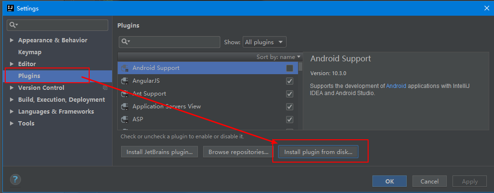
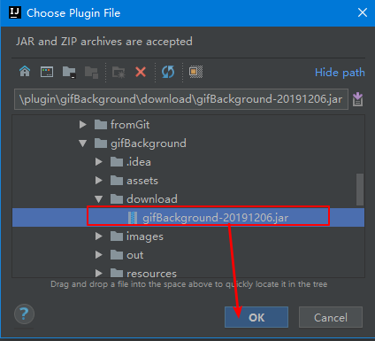
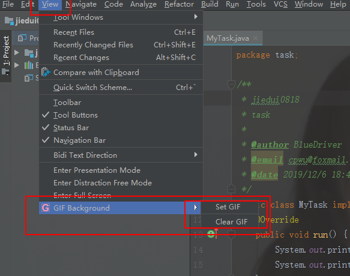

# What's Gif Background?

> This is an **IDEA Plugin** that allowed user to set **GIF** image background

### See

### How to install?

1. Download the file [gifBackground.jar](<https://github.com/BlueDriver/BackgroundGif/tree/master/download>)

2. Open your IDEA Settings panel

   

3. Choose the file which you download just now

   

4. Then click the OK and restart your IDEA

### How to use?

About the menu
* `Set Gif`: Set a Gif image as IDEA background, you will be ask to input a Gif file path
* `Clear Gif`: Clear the Gif background

### Thank you for your support

